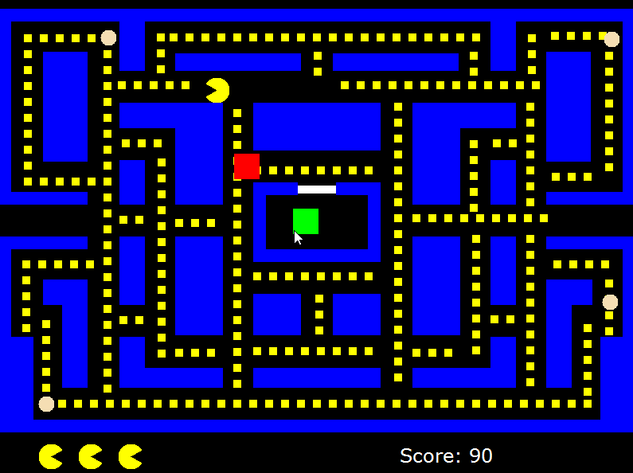

# Pacman
A pac-man clone for a final project in Grade 12 computer science 
The game is coded in C# and in Visual Studio and only has two of the ghosts. The ghosts follow a pattern around the arena.
After all pellets are eaten, the level resets. High scores are saved in a highscores xml file.

## Demo

You will need to use Microsoft Visual Studio 15 to build and run.
